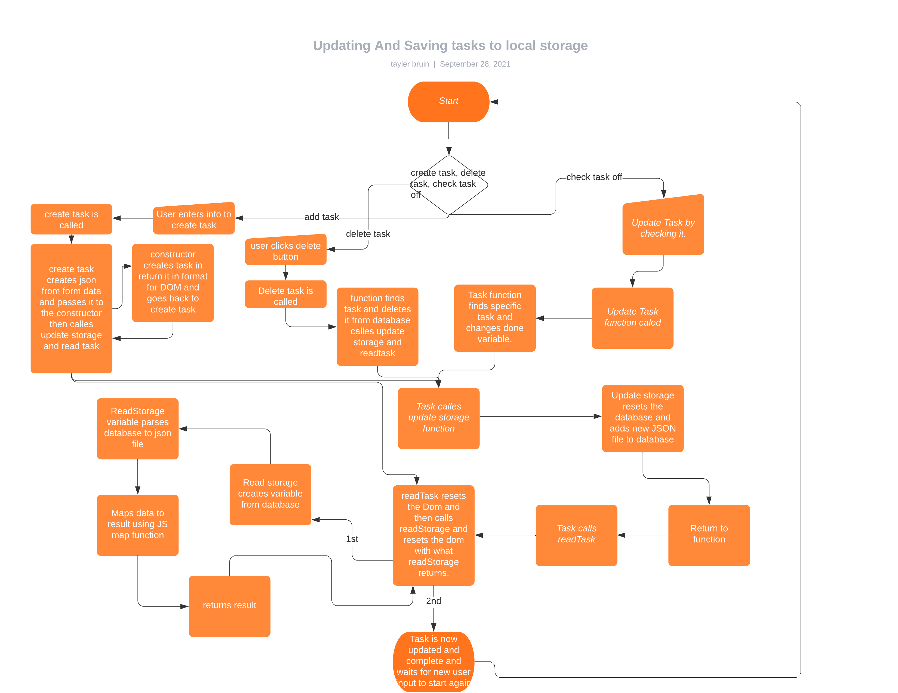
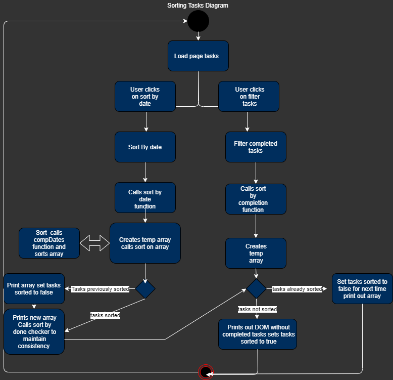
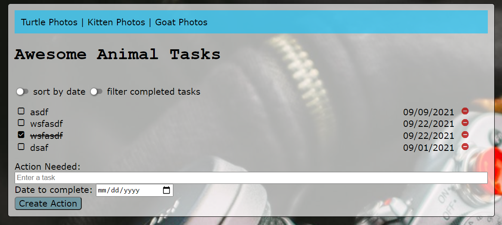
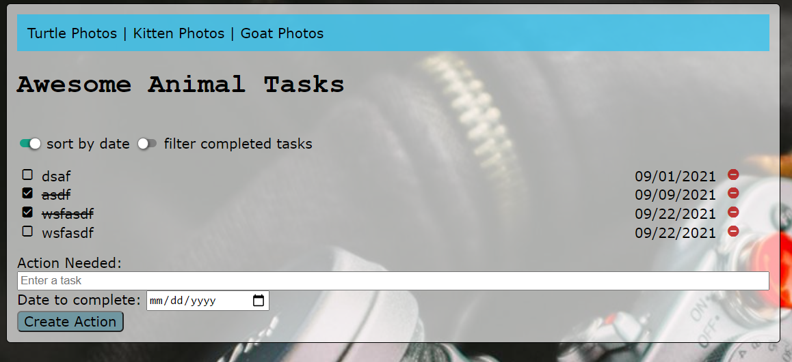
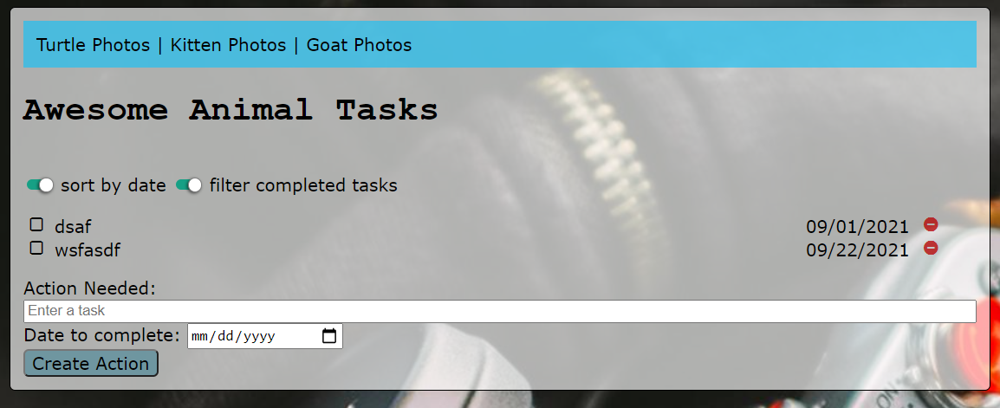

# INTRODUCTION:
### Tayler Bruin  
### 09/28/2021  
### Lab 2 Writeup  
# SUMMARY:
The purpose of this lab was to create a website that contained a functional list of tasks. The tasks would be created based off user input and stored in the local browser memory. The user also would have the ability to sort the tasks by date and tasks that have been checked off. Since these tasks were stored in local memory they would stay on the page until the user cleared the cache on their browser. This used JavaScript, HTML and CSS to accomplish these tasks and create a website.
# DESIGN OVERVIEW:
**index.html:** The purpose of this is to house the main page of the website and allow the user to call JavaScript functions by clicking buttons and entering information.  
**style.css:** The purpose of this document is to house all of the css for the project. It covers all of the classes and methods to make the final website appear attractive. This is also what makes the page have colors and images beyond black and white text. It hasn't changed since the last lab.  
**script.js:** This document houses all of the JavaScript to make the website functional. This includes all CRUD functions as well as their supporting functions to make them work. It also includes the functions to make sorting possible in the document.

Updating and Saving Tasks to Local Storage.

Shows how sort by date and filter by completed tasks functions work.

This is the base unsorted website with one task checked off.

This shows website sorted by date with two tasks checked off.

This shows website with tasks that have been filtered out and sorted by date.
# QUESTIONS: 
1. What are two differences and similarities between JavaScript and C++?  
**Response:** The first difference is that JavaScript sets variables dynamically so you don't have to set variable type when its created. Since variables are just dynamic code, functions are variables with code in them. The second difference is that JavaScript is an interpreted, not compiled, language. This means that JavaScript can behave differently and will usually not be as fast as C++, but you can change things dynamically. The first similarity between JavaScript and C++ is that both have loops that they are able to do for, while, ect. The second similarity is that they both can be object oriented programming languages.
2. What is the difference between JSON and JavaScript objects? 
**Response:** JSON is a filetype that is essentially a string with info. An object can be filled with JSON information, and most of the time, this is what JSON is used for. Objects, however, can be assigned with any amount of information and has functionality far beyond just data storage. Objects can also hold functions within them.
3. If you open your web page in two different browsers, will changes on one appear on the other? Why or why not? 
**Response:** No, it will not, since we are saving them on the local machine in the browser cache, so changes will only appear on the local machine in that specific  browser. Each browser has its own cache, so they would only show what is in their cache, not the other browsers' cache.
4. How long did you spend on this lab? 
**Response:** 10 hours
5. How did you protect your site against Cross-Site Scripting? Which type of Cross-Site Scripting did you protect against? 
**Response:** When a user enters in a < or > symbol they are converted to their equivalents &lt &gt which does not read as code. For display purposes they are converted back to those symbols. The specific types of scripting attacks that are prevented are DOM-Based attacks.
6. What is a Higher-Order Function? 
**Response:** A function that calls another function with a function as a parameter. The purpose of these is to be able to abstract your code and make each function only do one very specific thing; that way it appears cleaner.
7. What are the differences between the oninput, onkeyup, and onchange events? When do they trigger, when might you use one over the others? 
**Response:** oninput is the newest one so it may not be supported by all browsers. This is the most versatile one that listens for everything, but since support is ongoing there is no guarantees it will work on older systems. onkeyup listens for when the key is released, not when it is pressed. This means that it is most useful for checking when things have been typed. onchange listens for changes on whatever it is assigned to, not on keystrokes. This is useful when you have user input that will change something but isn't them typing something on the keyboard.
# LESSONS LEARNED:
### ADDING ITEMS TO THE DOM WITH JAVASCRIPT:
Adding items to the DOM with JavaScript can be difficult if one has not done it before. One way to do it that can be very difficult is to break up all of your items into different objects and add them all back together to be generated into HTML. A more efficient way to do it is with the `  parameter. This allows you to write the HTML how you want it to output with the separate objects as parameters in the HTML. This does require you to use $ on the objects so it is read correctly.
### JAVASCRIPT COMPARISONS:
When comparing in JavaScript and looking for something as false, it is important to note that false and 'false' are not the same thing. This is because false is a keyword in the JavaScript language while the other is a string. This means that if you are looking at a function and you want to be sure that you are looking for the keyword and not the string you would type (this.done == false) without apostrophes or quotations. This can be difficult to realize because many times it would return the correct output because they do not match but not always because it's not actually looking for the correct thing. 
### DELETING AN ITEM FROM AN ARRAY:
In JavaScript it is possible to delete a single item from an array using the .splice function. This function takes in two parameters--first the index of where to start deleting and second how many objects to delete. First you need to know the index of the item which can be found a variety of ways such as the findIndex function or a loop. Then you need to know how many objects to delete usually it is just 1 but you can do multiple.
# CONCLUSIONS:
- Use JavaScript to inject items into the DOM.
- Create CRUD functions to create items, read from the memory, update items, and delete them.
- Use logic to enable sorting of objects based on date or completion boolean.
- Use higher-order functions.
- Use JavaScript built-in constructor.
# REFERENCES:
https://www.w3schools.com/js/js_arrow_function.asp  
https://www.w3schools.com/js/js_comparisons.asp  
http://jsfiddle.net/T6XjV/  